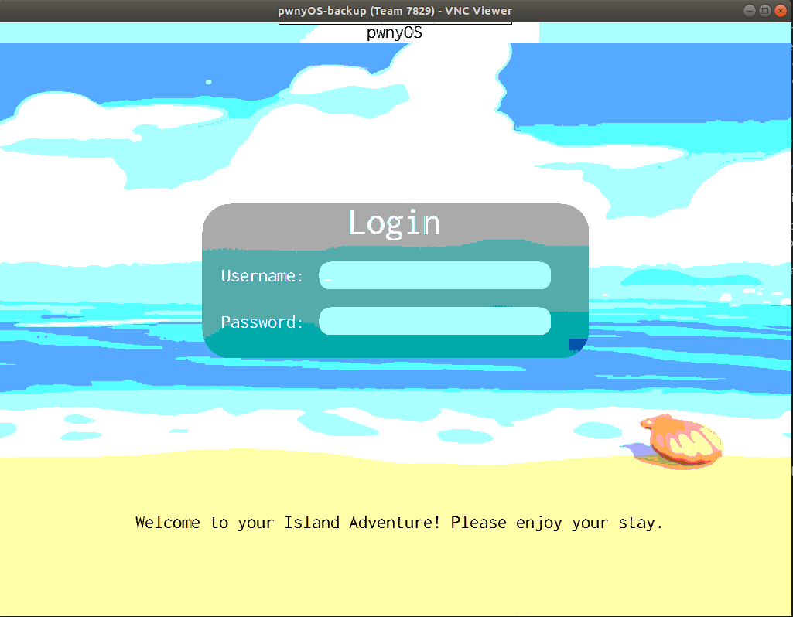
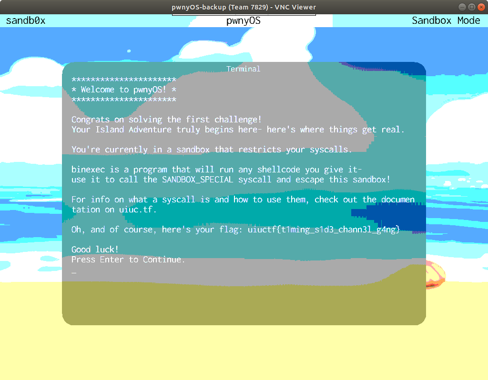

# How to get Started

## Challenge Description

> Welcome to pwnyOS!!
>
> pwnyOS is a custom x86 operating system that supports link-time kASLR, multitasking and kernel threads, execution of genuine ELF files, a realtime high resolution graphics engine, and a custom hierarchical file system. This OS was written from the ground up with its use as a challenge for UIUCTF 2020 in mind. All source code in the OS is 100% custom handwritten C and assembly- there are no libraries used, and none of its code can be found anywhere online. <i>This competition simulates an unprivileged user with physical access to a keyboard and terminal attempting to gain local privilege escalation on an unfamiliar system.</i>
>
> Documentation: [https://github.com/sigpwny/pwnyOS-2020-docs/blob/master/Getting_Started.pdf](https://github.com/sigpwny/pwnyOS-2020-docs/blob/master/Getting_Started.pdf)
>
> System Calls: [https://github.com/sigpwny/pwnyOS-2020-docs/blob/master/Syscalls.pdf](https://github.com/sigpwny/pwnyOS-2020-docs/blob/master/Syscalls.pdf)
>
> For your first challenge: Login to the OS with username sandb0x
>
> Password is 4 characters, all lowercase letters. First character is 'p'. I wonder if there's a way to leak the next char, knowing that the first part of the password is right...?
>
> This challenge is the result of months of hard work- Please respect the challenge and don't attempt to ruin the experience for others.
>
> Author: ravi

## Solution

From the name and description we can guess that the system is probably vulnerable to timing attack. Once we login with our VNC credentials to the VM hosting the custom OS, we are greeted with the following screen



From the description (or documentation) we know already know that the username is `sandb0x` and that the first character is `p`. Lets fiddle around with the password field and measure request-response time. In all of our attempts we keep the username fixed to `sandb0x`.

For the password `p` (correct first character) we measure that the server takes approximately 1.5sec to respond. On the other, for the password `a` (incorrect first character) the server responds immediately

[]()  | []()
:-------------------------:|:-------------------------:
  |  
Correct first character `p`             |  Wrong first character `a`

So I thought, for the second character let's try all the available lowercase ascii characters in my keyboard, starting from the line `qwerty`. Once I entered the password `pw` I quickly noticed that the request-response delay jumped up from 1.5 to approximately 3.0 seconds

<figure style="text-align: center;">
  
  <figcaption>First two characters "<code>pw</code>" are correct</figcaption>
</figure>

And then it hit me! The password is 4 characters long and starts with `pw`. Obviously it is `pwny`! So entering the credentials

```yaml
UN: sandb0x
PW: pwny
```

We have successfully logged in!



So the flag for this level is 

`uiuctf{t1ming_s1d3_chann3l_g4ng}`
